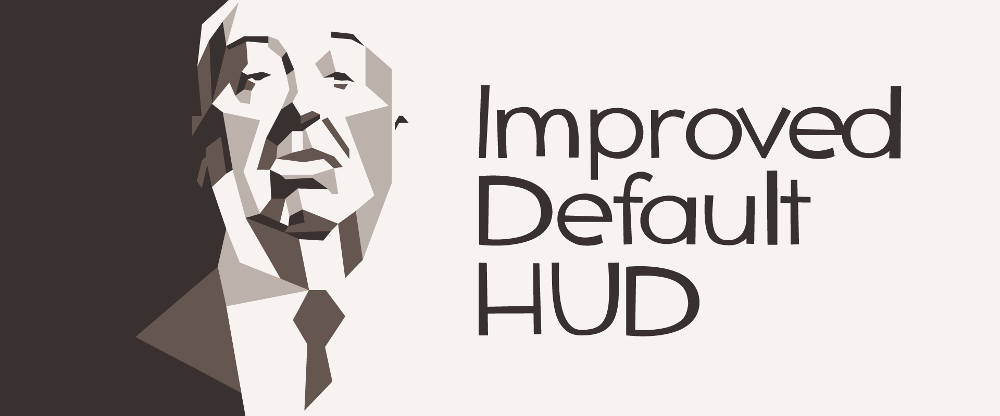

This is not a custom HUD in its usual meaning; instead, the focus is to add some fixes and improvements for the standard Team Fortress 2 UI, while keeping the style.

See the [features](#features) section for more information.  
See the [FAQ](#frequently-asked-questions-faq) for some possible questions you may have.

Gallery: https://imgur.com/a/P8CufId

Discussions:
- https://teamfortress.tv/thread/16751/improved-default-hud
- https://etf2l.org/forum/customise/topic-28385

Page on comfig.app: https://comfig.app/huds/page/improved-default-hud/

On Windows, use [Notepad++](https://notepad-plus-plus.org) to preview and edit files.  
On Linux, Kate from KDE is recommended. Download it from your distribution's repository.

HUD originally created by [Eniere](https://github.com/Eniere).  
Currently maintained by [Tiagoquix](https://github.com/Tiagoquix).

# Features
- No gray bars when spectating
- Larger combat text numbers (damage, healing, metal spent etc.)
- Last damage and healing done next to health cross
- Better target ID readability (for both players and buildings)
- Keyboard shortcuts in the equipment menu, backpack view and loadout screen
- High-quality item previews in the backpack view, loadout screen, Mann Co. store and more (no additional files needed; done via HUD file tweaks)
- Better spectator tournament support (`cl_use_tournament_specgui 1`)
- No duplicate crosshair when coaching
- Minor scoreboard improvements
- Minor adjustments to 3D class portraits angles
- More death notices on the screen at once

# Notes

## Recommended ConVars
The following are some ConVar recommendations for a better experience with IDHUD.
```
cl_spec_carrieditems 						0      // Hides the loadout items being used by the player you are spectating
tf_hud_show_servertimelimit 				1      // Show server time limit in addition to round time
tf_hud_target_id_alpha 						255    // Make HUD target ID background opaque to improve visibility
tf_hud_target_id_disable_floating_health 	1      // Places TargetID HealthBar inside the character nameplate
```
If you use mastercomfig, `tf_hud_show_servertimelimit` is enabled by default for all presets, and `tf_hud_target_id_alpha` can be controlled using the "Panels" module. The rest of the commands can be managed via the advanced options menu or directly through the console.

## Improved spectator tournament GUI
The HUD comes with improvements for the spectator tournament GUI. It works when servers enable the `mp_tournament` ConVar and `cl_use_tournament_specgui 1` is set on your game client.

However, keep in mind that it is designed for competitive game modes such as 6v6, Prolander and Highlander. Enabling it out of those game modes may result in some weird behavior in custom game modes.

### Different aspect ratios
*This is only applicable if you enable `cl_use_tournament_specgui`.*

If you play on 4:3 or 16:10 rather than the 16:9 aspect ratio, you may have to edit the line `team2_player_base_offset_x` in the `resource/ui/spectatortournament.res` according to the comment.

The default value is adjusted for the 16:9 aspect ratio.

# Frequently asked questions (FAQ)
#### Could you make the HP numbers, the ammo counter and many other things centralized for a better gameplay experience?
Yes, we could. However, we don't have plans to. IDHUD is meant to be simple while still retaining most of the default HUD experience, and that includes keeping things at the corners of the screen, which is how the default HUD operates.

Some custom maps also expect the HUD to be the game's default, and so they put things on the center of the screen. Many popular HUDs have problems with this because they often obsfucate such elements due to their centralized nature, which ends up making such elements hard to read. [This map](https://steamcommunity.com/sharedfiles/filedetails/?id=2487430950) is a good example of this problem.

If you want the default HUD, but centralized, check out the [Middle Mann Hud](https://gamebanana.com/mods/445578).

#### Why don't you provide support for custom crosshairs?
Because they don't work with the [Ambassador](https://wiki.teamfortress.com/wiki/Ambassador)'s dynamic crosshair.  
Also, they don't hide themselves while taunting, and could cause conflicts in some custom game modes with custom crosshairs.

#### Why don't you provide support for hitmakers?
Because we already have hitsounds in the game. :)  
Also, they usually tend to work better with custom crosshairs, which we don't support (see question above).

#### Why don't you provide support for viewing the BLU character in the loadout screen?
Because it only works in the main menu or in a local server, due to the fact that it uses the `r_skin` command, which is protected by `sv_cheats`.  
Even when using the `r_skin` command, not all things work as expected — Australium weapons have graphical corruptions, and Warpaints don't change their team colors accordingly.
